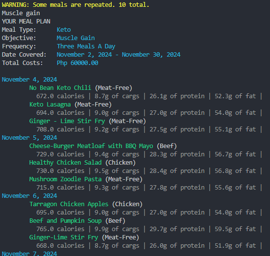

# Meal Plan Generator

SEDEV210 - Programming for Data Science
Masters of Science in Data Science

LT 6
- Cayco, Francis Mark M.
- Pelayo, Angela Elaine F.
- Sangalang, Luisito II M.
- Madarang, Andrea Yna M.
- Verma, Srijat

## Rationale
Meal Plans have increased in popularity over the past years. The benefits of which is the reduced 
mental load in deciding and planning meals which will free up time and make it easier for consumers 
to be able to meet their health or fitness goals. Meal plans offer targeted diets that would assist 
consumers in ensuring that they are aligned to their targets, may it be to reduce weight, to gain 
muscle, or to improve their overall health with a well rounded meal. 

The proposed system will take in the information that the users will provide regarding their biodata 
and their targets to determine which plan would best suit them. It will provide recommendations on the 
types of foods that they should focus on to be able to meet their desired goals.

### Data Requirements
The biodata required would be the biological gender of the consumer, age, fitness level, current weight, and target weight. These questions will be prompted at the beginning of their application to provide the information needed to perform the prediction proposed. The data will also require a person’s current activity level to be able to account for the daily requirements of each individual.

### Food Mapping
Food information is stored within the program that contains information regarding the types of food and their caloric impact/portion size. The program will cross-reference the types of food with the needs of the user to build the meal plan provided for the selected duration.

### Algorithm-Based Meal Planning
By using the biodata provided, the system will be able to calculate the optimal meal plan for the customer. Taking into consideration the person’s current activity level and their goals, the system will be able to account for the number of calories each individual needs to either maintain a calorie deficit or support an increase in muscle gain.

## Features
### Product Flow Diagram
<div style="text-align: center;">
  
</div>

### Meal Criteria
#### Keto Meals
- Low-carb, high-fat diet preference
- Aiming for weight loss, blood sugar management, or cognitive benefits
- Interested in keeping carbohydrate intake at or below 5-10% of total daily intake
#### Organic Meals
- Prioritizes consumption of ingredients without synthetic pesticides, herbicides, or GMOs
- Prefers sustainably sourced, environmentally friendly foods
- Concerned about the purity and quality of food, avoiding synthetic additives
#### Non-Organic Meals
- Budget-conscious, preferring more affordable options
- Less concern about organic sourcing, prioritizing taste or convenience
- No specific dietary restrictions related to organic food
#### Vegetarian Meals
- Follows a vegetarian diet, avoiding meat but consuming dairy, eggs, and other animal by-products
- Prefers plant-based meals for ethical, environmental, or health reasons
- Interested in meals rich in fruits, vegetables, grains, nuts, and seeds, without meat-based ingredients

### Meals vs Calories
The following is a general guideline for the number of calories per meal based on the user's fitness objective:

| Fitness Objective | OMAD (One Meal a Day) | 2MAD (Two Meals a Day) | 3MAD (Three Meals a Day) |
|-------------------|-----------------------|------------------------|--------------------------|
| Weight Gain       | 2,500 - 3,500+ calories | 1,250 - 1,750+ calories/meal | 833 - 1,167+ calories/meal |
| Weight Loss       | 1,200 - 1,800 calories | 600 - 900 calories/meal | 400 - 600 calories/meal |
| Weight Maintain   | 1,800 - 2,400 calories | 900 - 1,200 calories/meal | 600 - 800 calories/meal |

### The Dataset
The dataset contains the following columns:

| Meal                | Type  | Main Ingredient | Carbohydrate (%) | Protein (%) | Fat (%) |
|---------------------|-------|-----------------|------------------|-------------|---------|
| Herbed Chicken with Mushrooms | Keto  | Chicken         | 10               | 30          | 60      |
| Greek Meatballs     | Keto  | Beef            | 10               | 30          | 60      |
| Fried Salmon Patties| Keto  | Seafood         | 10               | 30          | 60      |
| Turmeric Fish       | Keto  | Seafood         | 10               | 30          | 60      |

The calorie count and essential nutrients calculation is based on the dataset provided. Each meal entry includes the type of meal, the main ingredient, and the percentage composition of carbohydrates, proteins, and fats. This information is used to calculate the total calorie count and the distribution of essential nutrients for each meal.

## Usage
### Installation
Run the following command to clone the repository:

```git clone https://github.com/PeteCastle/meal-plan-generator```

Ensure you have the required dependencies installed:

```pip install -r requirements.txt```

To generate the meal plan document, you need to have a Latex distribution installed on your machine. You can download the latest version of MikTex from the following link: [MikTex](https://miktex.org/download)

*Not installing Latex compiler won't prevent you from using the program - only during the generation of the document*

### Execution
Run the following command to execute the program:

```python main.py```

## Output
### User Preferences


### Meal Plan Output (CMD)


### Meal Plan Output (Document)
